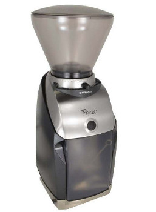
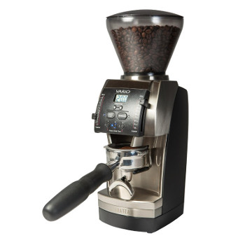
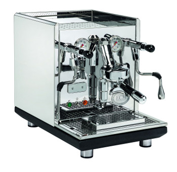

# Espresso coffee gear

This page will take about espresso machines, grinders for espresso and
the general preparation of espresso and its drinks.

## Current gear

* Mazzer Mini-E Type A
* Mahlkönig PEAK
* ECM Synchronika
* Aillio Bullet R1
* VST baskets (18g + 20g)
* Caffelat VST tamper

## Previous gear

* Baratza Preciso
* Baratza Vario
* Rancilio Silvia V2

## Baratza Preciso

We bought the Silvia and the Preciso as a combo from Seattle Coffee
Gear (SCG).  Overall the buying experience was painless but I don't believe
the Preciso is a good enough entry level grinder for espresso.
In our experience, the grind was too distrubuted which created a lot
of channeling.
SCG was not able to help much except by returning the
grinder and the espresso machine, so I decided to call Baratza.
Turns out the Preciso had a broken plastic bit already.
Baratza said the Vario was a better choice and for a bit more extra
money they could get me the Vario if I returned the Preciso.
We didn't think twice and the Vario arrived a few days later.

[Particle distribution graph link.](https://www.home-barista.com/downloads/baratza_preciso_particle_dist.pdf)

       

## Baratza Vario

This was our first entry level burr grinder.  It lasted 3 years and it
was paired with a Silvia V2.  The grind distribution was much better
than the Preciso and it was the first time I was happy about our 18g
3rd wave coffee espressi.  The Vario was pretty much our learning tool
about espresso grinders.
Two of the most notable problems with this grinder were the dials and
the internal mess.  Over time, the dials decided to move on their own
and we had to hold them all the time when we were griding.  The second
problem was how messy the internals would get after a few months.  For
some reason the ground beans sometimes would leak inside the case and
over time they would accumulate.
This grinder is reasonably consistent and retains very little grounds.

[Particle distribution graph link.](https://www.home-barista.com/downloads/baratza_vario_particle_dist.pdf)

   

## Rancilio Silvia V2

Our first proper espresso machine was the Silvia.
We chose this machine as part of the bundle from SCG (with the Baratza
Preciso) because the price was right and I thought it was more than
enough.  Later in life I would learn about its shortcomings.

For now let's discuss the updates:

 * PID from Auber
 * Pressure gauge
 * Flat screen shower screen
 * Insulated boiler, steam wand tube and group head

All of them, except the PID controller, came from pidsilvia.com.
The PID made a big difference since it improved shot consistency.
However, the group head temperature variance isn't great, so flushing
water was still necessary.  This PID controller can also perform a
fake pre-infusion. Essentially the pump runs for a determined amount
of seconds so that the pressure builds up inside the portafilter. Then
it stops the pump for another X number of seconds before turning the
pump back again for brewing espresso.  Since I wanted 2 bar of
"pre-infusion", we got a pressure gauge next.  We made a hole for the
pressure gauge and another hole for the PID on the top of the Silvia
using a CNC machine and the result was extremly clean (see pictures on
pidsilvia.com).
When paired with a good grinder, this machine is pretty good for
espresso, but the relatively long wait to get the boiler at steam
temperature didn't really appeal to us.  When we pulled two shots to
make two cappuccinos, by the time the milk was ready, the coffe was
significantly colder and the crema was thin.

## Mazzer Mini-E Type A

The Mazzer Mini-E has 64mm flat burrs and was bought to replace the
Vario.  The shortcomings of the Vario for espresso, a good promotion
from Whole Latte Love and a buyer for the Vario led us to chose the
Mazzer Mini.  This grinder was initially paired with the Silvia and we
noticed a improvement on the coffee quality immediately.  We also
saw how consitent it was.  Even today, apart from the retention
problem, I can measure 18.0 grams of coffee beans and what will come
out is 18.0 (+- 0.1) ground coffee.
The most annoying problem with this grinder is how many beans it
retains.  I've measured between 3 and 4 grams retained in:

* the burrs
* the burr casing
* the funnel
* the anti-static screen

The worst place, by far, seems to be the anti-static screen which is used to
reduce static (of course) and clumping but has the side effect of retaining
grounds.  When making several shots in a row (like at a coffee shop)
it's definitely not a problem, but you wouldn't want to use ground
coffee that's been siting in the grinder.  The only way to deal with
this problem is to grind 4 grams of coffee (wasteful) or to live with
it and accept that the first coffee of the day might not be perfect. 

About 2 years after purchasing it, I discovered that the *Super Jolly*
burrs would also fit.  I'm not sure why Mazzer didn't use these burrs
in the first place because they are definitely better.  They cut the
grind time in half (less heat) and they produce a little less
clumping.  This didn't fix the rentention problem, of course.

## ECM Synchronika

For a while, we thought about replacing the Silvia, but we didn't
really know how.  I've spent a long time looking at Heat Exchanger
(HX) machines but the fact that it requires flushing water every time
we would want to make espresso wasn't that interesting.
We were pretty sure we wanted an E61 group head because the saturated
group head machines were outside our budget.
We quickly decided on a Dual Boiler machine since they can brew and
steam at the same time, just like the HX, but the temperature stability is
much better.  Most of these machines include two PIDs, one for each
boiler and you can chose the temperature of each boiler individually.
There are plenty of DB machines to chose from.  The Synchronika set
itself apart from the others purely based on how it looks.  Appliances
are often neglected but the fact is that we use them every single day
and it's no fun if they don't look pretty. 

In 2016 we went for it and bought it from Clive Coffee.
Apart from looks, the machine includes a built in timer and a shot
counter that warns the user when it's time to clean up.  Very simple
to implement, but handy.
Having the possibility of plumbing the machine was also a must have.
We ended up buying the BWT water filtration / softner kit from Whole
Latte Love.  Thankfully, our water is soft enough that scale build up
wouldn't be an immediate problem, but with this system we get better
quality water and less scale.  We didn't connect the drip tray to the
sink because it was tricky (it's gravity fed) and I would have to
install a one way valve to make sure a clogged sink wouldn't cause
nasty water to flow into the drip tray.  It was more trouble than it's
worth since the drip tray has to be cleaned daily anyway.

The steam wand has two holes but they are tiny.  There's a learning
curve to get proper milk, but it can be done.  We're currently
experimenting with a four hole steam wand tip.

## Mahlkönig PEAK

TBD!
