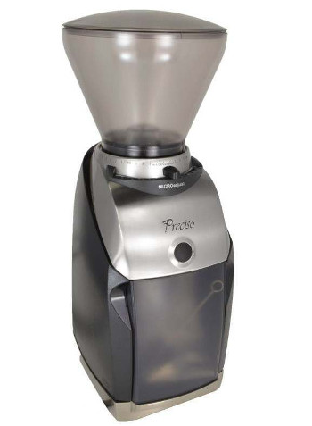
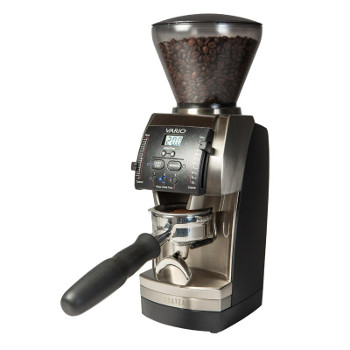
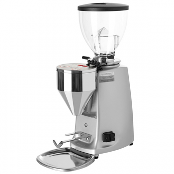
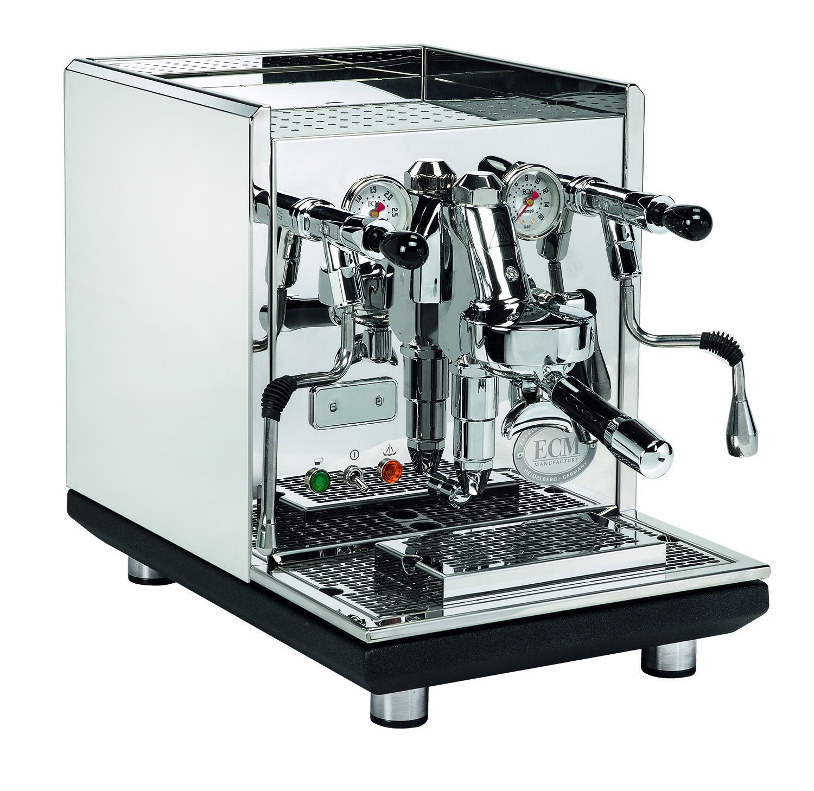

# Musings on coffee (mostly espresso)

This page will take about espresso machines, grinders for espresso and
the general preparation of espresso and its drinks.

## Current gear

* Mazzer Mini-E Type A
* ECM Synchronika

## Previous gear

* Baratza Preciso
* Baratza Vario
* Rancilio Silvia V2

## Baratza Preciso

We bought the Silvia and the Preciso as a combo from Seattle Coffee
Gear.  Overall the buying experience was painless but I don't believe
the Preciso is a good enough entry level grinder for espresso.
In our experience, the grind was too distrubuted which created a lot
of channeling.
Seattle Coffee Gear was not able to help much except by returning the
grinder and the espresso machine and I decided to call Baratza.
Turns out the Preciso had a broken plastic bit already.
Baratza said the Vario was a better choice and for a bit more extra
money they could get me the Vario if I returned the Preciso.
We didn't think twice and the Vario arrived a few days later.
                

## Baratza Vario

This was our first entry level burr grinder.  It lasted 3 years and it
was paired with a Silvia V2.  The grind distribution was much better
than the Preciso and it was the first time I was happy about our 18g
3rd wave coffee espressi.  The Vario was pretty much our learning tool
about espresso grinders.
Two of the most notable problems with this grinder were the dials and
the internal mess.  Over time, the dials decided to move on their own
and we had to hold them all the time when we were griding.  The second
problem was how messy the internals would get after a few months.  For
some reason the ground beans sometimes would leak inside the case and
over time they would accumulate.

                

## Rancilio Silvia V2

## Mazzer Mini-E Type A

The Mazzer Mini-E has 64mm flat burrs and was bought to replace the
Vario.  The shortcomings of the Vario for espresso, a good promotion
from Whole Latte Love and a buyer for the Vario led us to chose the
Mazzer Mini.  This grinder was initially paired with the Silvia and we
noticed a improvement on the coffee quality immediately.  We also
saw how consitent it was.  Even today, apart from the retention
problem, I can measure 18.0 grams of coffee beans and what will come
out is 18.0 (+- 0.1) ground coffee.
The most annoying problem with this grinder is how many beans it
retains.  I've measured between 3 and 4 grams retained in:

* the burrs
* the burr casing
* the funnel
* the anti-static screen

The worst place, by far, seems to be the anti-static screen which is used to
reduce static (of course) and clumping but has the side effect of retaining
beans.  When making several shots in a row (like at a coffee shop)
it's definitely not a problem, but you wouldn't want to use ground
coffee that's been siting in the grinder.  The only way to deal with
this problem is to grind 4 grams of coffee (wasteful) or to live with
it and accept that the first coffee of the day might not be perfect. 

About 2 years after purchasing it, I discovered that the *Super Jolly*
burrs would also fit.  I'm not sure why Mazzer didn't use these burrs
in the first place because they are definitely better.  They cut the
grind time in half (less heat) and they produce a little less
clumping.  This didn't fix the rentention problem, of course.

## ECM Synchronika

